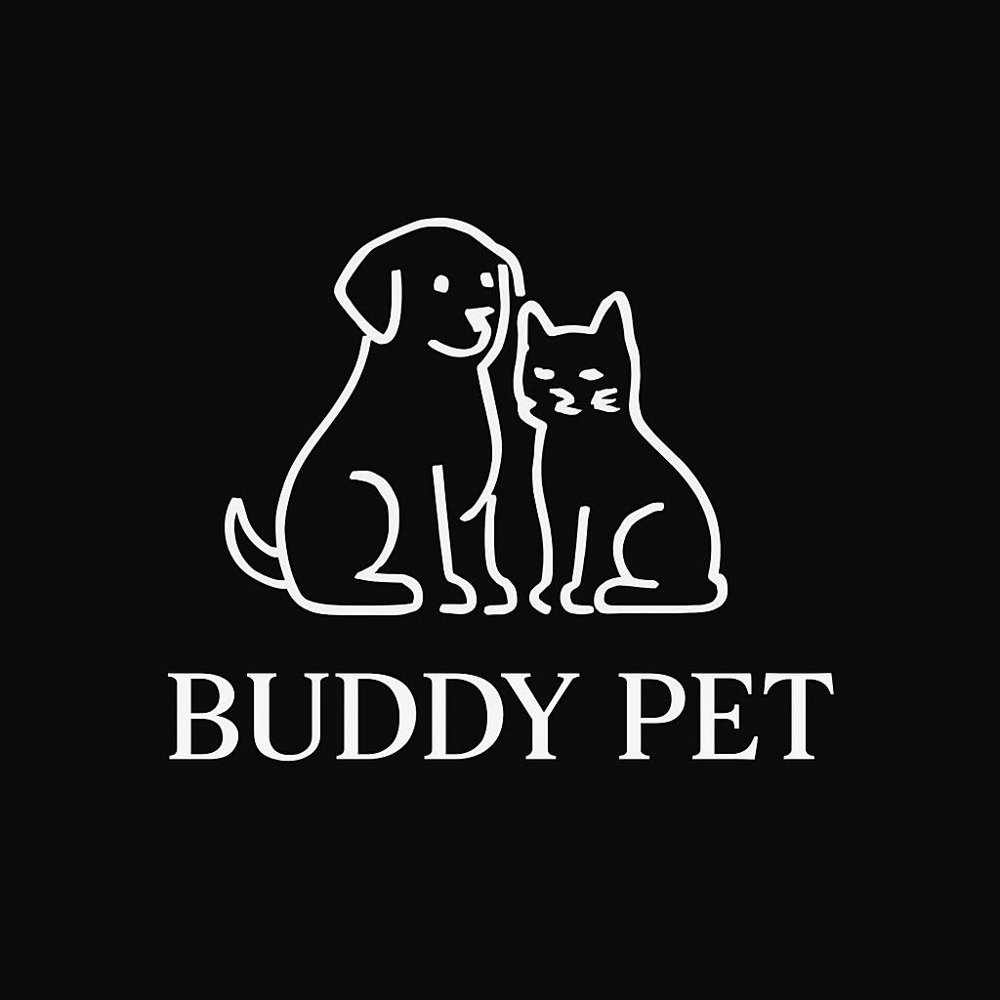

# 🐾 Pet Hotel Booking System – Django Project

A full-featured Django-based booking platform designed for a pet hotel. This application allows users to book rooms for their pets, select additional services (like grooming or transportation), and receive multi-pet discounts automatically. Built with scalability, admin control, and a clean UI in mind.

## 🔧 Tech Stack

- Python & Django
- PostgreSQL (or SQLite for development)
- HTML5, CSS3, Bootstrap 5
- JavaScript (for calendar/date logic)
- Django Admin

## 📦 Features

- Calendar-based check-in/check-out booking system
- Multi-pet discount logic (configurable in the admin)
- Room availability management to prevent overbooking
- Admin dashboard for managing pets, users, services, and bookings
- Add-on services: grooming, meals, water sports, transport, training
- Responsive layout with Bootstrap styling
- Secure user authentication system

## 🧠 Business Logic Highlights

- Dynamic room availability: rooms become unavailable once booked for overlapping dates.
- Multi-pet discount logic applies automatically after the first pet.
- Admin panel allows configuration of:
  - Total rooms
  - Discount rate
  - Available services

## 🚀 Getting Started

Clone the project:
```bash
git clone https://github.com/Daniel0Marsh/pet-hotel-django.git
cd pet-hotel-django
```
Create a virtual environment & install dependencies:
```bash
python -m venv venv
source venv/bin/activate  # or venv\Scripts\activate on Windows
pip install -r requirements.txt
```
Run migrations & start the server:
```bash
python manage.py migrate
python manage.py runserver
```
Visit http://127.0.0.1:8000/ to use the system locally.

## 📸 Screenshots

| Logo 1                      | Logo 2                      |
|-----------------------------|-----------------------------|
|  |  |

---

Made by [Daniel Marsh](https://github.com/Daniel0Marsh) • [codeblock.io](https://codeblock.io)
